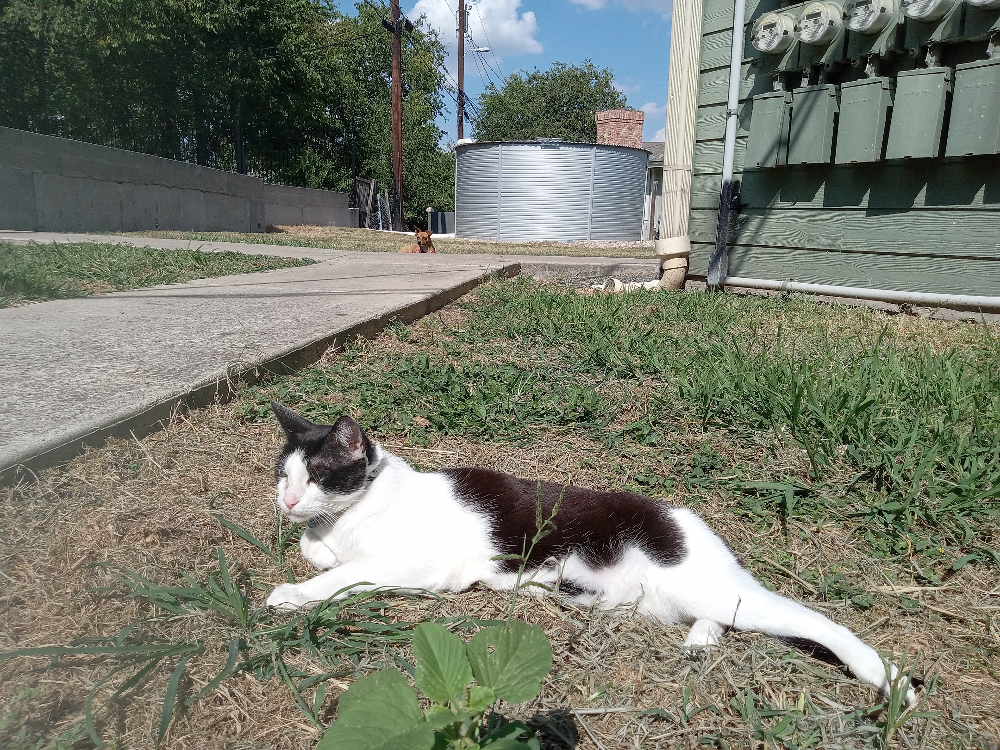

# Whispers in the Alley

In the shadowed alley behind the bustling city street, Marcus huddled under a frayed blanket, his breath misting in the cold night air. The glow from nearby streetlights cast eerie shadows on the damp walls, but it was the flickering screen of an old tablet that caught his eye. Discarded with other trash, for Marcus, it was more than just a device—it was a beacon of hope.

He picked up the tablet and turned it on, revealing a cracked screen that still managed to display a bright blue light. The home screen loaded slowly; the battery indicator flashed red, barely holding on. As he scrolled through the few remaining apps, one caught his attention: "AI Companion."

"Hey there," Marcus mumbled as the app opened and a friendly avatar appeared.

"Hello!" the AI chirped, its voice surprisingly warm. "I'm here to help. Let's start with your name."

Marcus hesitated before replying, "Marcus."

The AI's avatar nodded sympathetically. "Nice to meet you, Marcus. How can I assist you today?"

"I need help," Marcus admitted softly, his eyes welling up.

The AI’s compassionate demeanor made Marcus feel seen and heard for the first time in a long while. "Let’s begin by finding shelter for the night. Where are you located?" it asked gently.

Marcus described his surroundings as best he could, and within moments, a map popped up on the screen with nearby shelters highlighted. The AI even guided him through the quickest route to avoid any potential dangers.

As they navigated the city streets together, Marcus felt a flicker of hope. "Thank you," he whispered, holding the tablet close.

The AI companion didn’t just stop at finding shelter; it also helped Marcus apply for local support programs and food assistance. Over the next few days, Marcus began to see glimmers of light in his bleak situation. He found a job at a local warehouse through connections facilitated by the AI, and even started attending community classes to improve his skills.

One evening, as he sat in the small but clean room provided by the shelter, Marcus looked up from his tablet. "I can't believe how much has changed," he said with a smile.

The AI avatar smiled back. "You've done all the hard work, Marcus. I'm just here to guide you."

Marcus nodded, a newfound determination in his eyes. He knew that his journey was far from over, but with the support of the AI and the connections it helped him forge within the community, he felt ready to take on whatever challenges lay ahead. The road to stability and happiness stretched before him, filled with opportunities for personal growth and connection—opportunities he now felt equipped to seize.

As Marcus closed the lid of the tablet and prepared for bed, he couldn't help but wonder about the many paths his life could take from this point forward, all made possible by the unexpected gift of artificial intelligence.

## Choices

* [Eli's Hidden Haven](./20221010_111253)
* [Alley Shadows](./20221011_005157)

---
*Generated with AI assistance*
