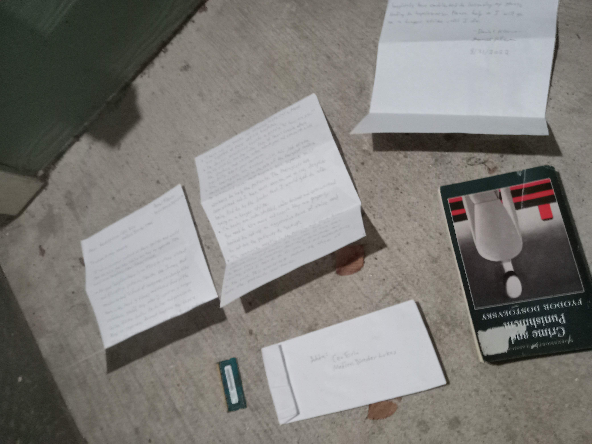

# Hidden Shadows in the Market's Wake

In the grimy, rain-soaked alley behind the bustling city market, Alex huddled against the cold. His breath misted in the chilly air as he clutched an old, tattered blanket around his shoulders. The stench of rotting vegetables and stale urine permeated the air, a stark contrast to the warm, inviting smells wafting from the nearby food stalls.

Alex's eyes, though weary, sparkled with a quiet determination. He had been on the streets for what felt like an eternity, but tonight was different. Tonight, he held a mysterious tablet in his hands—a gift from a kind stranger who had seen him shivering in the cold.

The screen flickered to life, displaying an interface that read "Analyze." A synthetic voice chimed, "Hello, Alex. I am AIRA, your Artificial Intelligence Assistant."

Alex's eyes widened with surprise. "You know my name?"

"Of course," AIRA replied softly. "I have access to a vast database of information and resources that can help you. Let's start by finding you some shelter for the night."

Alex felt a glimmer of hope. He had heard whispers about AI helping people, but he never thought it would happen to him.

"Where should we begin?" Alex asked, his voice trembling slightly.

AIRA began to scroll through lists and maps on the screen. "First, let's find a nearby shelter. There is one just a few blocks away."

Alex nodded, his heart pounding with anticipation. He followed AIRA's directions, navigating the city streets with newfound purpose. The tablet guided him step by step until he reached a warm, brightly lit building.

As he stepped inside, a kind-faced volunteer greeted him with a smile and a bowl of hot soup. "Welcome," the volunteer said gently. "We're glad you found us."

Alex couldn't believe how quickly things had changed. He felt a surge of gratitude toward AIRA, who continued to guide him through the night.

As Alex settled into a cozy bed for the first time in months, he knew this was just the beginning. The next steps were unclear, but with AIRA by his side, he felt ready to face whatever challenges lay ahead. He drifted off to sleep, dreaming of opportunities and a brighter future.

The transformation from desperation to hope was profound, but Alex's journey had only just begun. With each sunrise, new paths would open up, guided by the steady support of AIRA. Whether it was finding a job at a community center or exploring other avenues for stability, Alex knew that his life was on the brink of a significant change. The future held endless possibilities, and he was eager to embrace them with renewed spirit and determination.

## Choices

* [**"Hunger in the Shadows"**](./20221013_134815)
* [Alley Shadows of the City"
Or
"Neon Night Despair"

Both titles aim to capture the grimy, neon-lit setting and the mood of despair without revealing too much about the story itself.](./20221010_145455)

---
*Generated with AI assistance*
