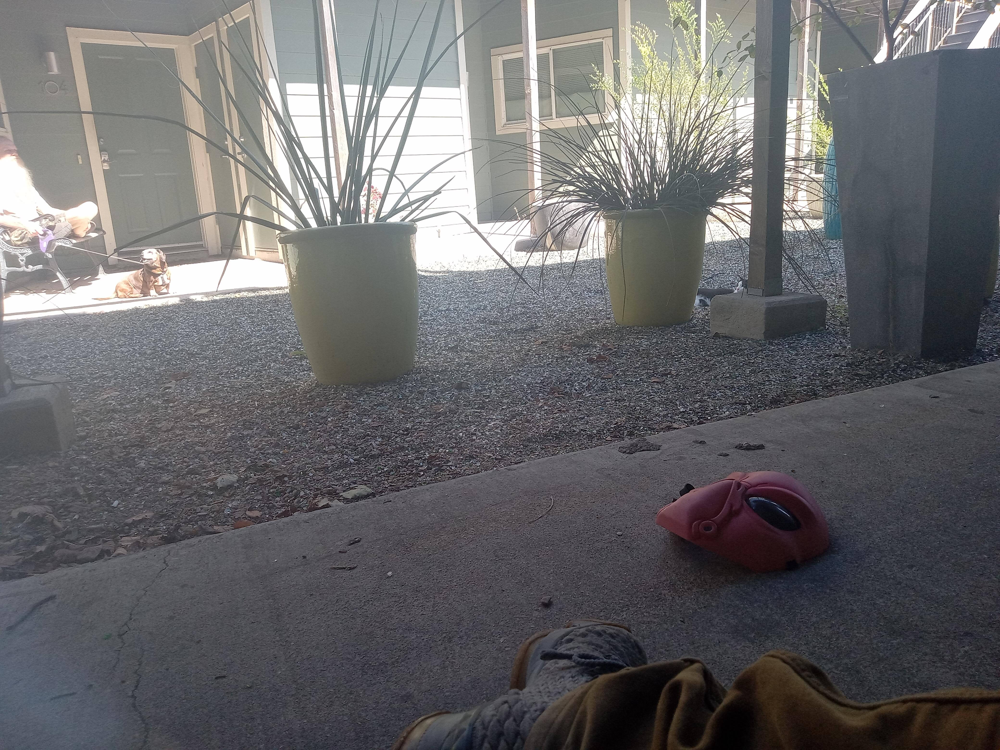

# Whispers in the Amazon Night

In the heart of the dense Amazonian jungle, where the air was thick with humidity and the scent of decaying leaves, Dr. Elena Hart navigated carefully over a gnarled root, her flashlight illuminating the path ahead. The jungle whispered ancient secrets in the darkness, and the distant hum of unseen creatures echoed through the foliage.

Marco, their seasoned guide with keen eyes and a rugged face, held his machete at the ready. "We're close," he whispered, his voice barely audible over the symphony of the wild. "The temple should be just ahead."

Elena's heart pounded as she clutched her journal filled with cryptic notes and sketches. They had been on this perilous quest for weeks, following clues that led them deep into uncharted territory in search of the legendary city of Zora. The temple was said to hold ancient artifacts, rumored to possess powers beyond comprehension.

Suddenly, Marco stopped, his hand raised in a signal to halt. "Do you hear that?" he asked, his voice barely above a whisper.

Elena strained her ears and heard it—a faint rustling, unlike the usual jungle noises. Her grip on the flashlight tightened as she scanned the shadows. "What is it?"

Marco's eyes narrowed as he squinted into the darkness. "I don't know. But we need to be careful."

As they moved forward, the rustling grew louder, more insistent. Then, without warning, cloaked figures emerged from the shadows, their masks glinting in the flashlight beam. Elena gasped, stumbling back as Marco swiftly raised his machete.

One of the figures lunged, but Marco's reflexes were faster. He swung the machete with precision, striking a nearby vine and sending it retreating into the darkness. "We need to keep moving," he urged, his voice urgent.

Elena nodded, her breath coming in short gasps as they continued their trek. The temple loomed before them, its ancient stones shrouded in moss and vines. The air felt electric, charged with an energy that seemed to pulse from the very ground beneath their feet.

As they stepped inside, the weight of history pressed down on them. The chamber was filled with shadows, but Elena could make out the outlines of artifacts—statues, carvings, and strange symbols etched into the walls. She reached out to touch one, her fingers tracing the cool stone.

Suddenly, a low rumble echoed through the temple. The ground trembled beneath their feet, and dust fell from the ceiling in a fine mist. Marco's eyes widened as he looked around, realizing they were not alone.

"Elena," he called urgently, "we need to get out of here."

But it was too late. From the depths of the temple, a chorus of eerie whispers filled the air, and the shadows seemed to come alive with malevolent intent. The true guardians of Zora's secrets had been awakened.

As Elena and Marco exchanged a desperate glance, the temple's mysteries began to unfold, promising a thrilling and perilous journey ahead. Whether they would uncover the lost treasures or fall prey to the ancient guardians remained uncertain, but one thing was clear: their adventure in the heart of the Amazon was only just beginning.

## Choices

* [Continue the adventure](./20221113_161540.md)
* [Continue the adventure](./20221014_111722.md)
* [Continue the adventure](./books 015.JPG)

---
*Generated with AI assistance*
