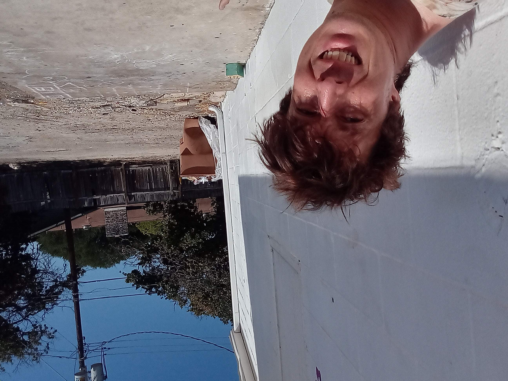

# **"Hunger in the Shadows"**

In the grimy alley behind the bustling city market, rain lashed down on Alex as he huddled under his makeshift tent. The stench of rotting garbage mingled with the damp air, creating an oppressive atmosphere. His stomach gnawed at him, echoing the emptiness within.

"Here you go," a kind voice broke through his thoughts. An old woman handed him a steaming cup of coffee and a sandwich. "Keep warm."

Alex managed a weak smile. "Thanks, Sarah." He took a sip, feeling the warmth spread through his chilled bones.

Suddenly, he noticed a small device tucked into the corner of his tent—a tablet, left behind by one of the market's patrons. Intrigued, Alex picked it up and turned it on. The screen flickered to life, displaying an AI interface with the word "Analyze."

"Hello," the AI said in a soothing voice. "I am AIRA. How can I assist you today?"

Alex stared at the device, his mind racing. "Can you... help me find shelter?" he asked hesitantly.

AIRA hummed softly as it processed his request. "Of course. Let's start with your needs and preferences."

As Alex spoke, AIRA listened intently, gathering information. The AI’s voice was comforting, a stark contrast to the harsh reality outside. Within minutes, AIRA had compiled a list of potential shelters tailored to Alex's situation.

"Here are some possibilities," AIRA said, displaying a map on the screen with marked locations and details. "I can also help you navigate the process of securing housing and connecting with social services."

Alex felt a glimmer of hope. For the first time in months, he had a plan—a path out of his current despair.

The rain began to ease as Alex started making calls to the shelters listed by AIRA. He knew it wouldn't be easy, but with AIRA's support, he felt empowered. The city might still feel cold and unforgiving, but inside his tent, a spark of determination burned brighter than ever.

As the night deepened, Alex looked out at the dimly lit alley, knowing that tomorrow would bring new challenges—but also new possibilities. With AIRA by his side, he was ready to face whatever came next, whether it be finding a job, seeking further assistance from social services, or even reconnecting with old friends who might offer support. The future, once bleak and uncertain, now held the promise of transformation and growth.

## Choices

* [Neon Shadows in the Cold](./20221013_125636)
* [Hidden Shadows in the Market's Wake](./20221011_005157)

---
*Generated with AI assistance*
