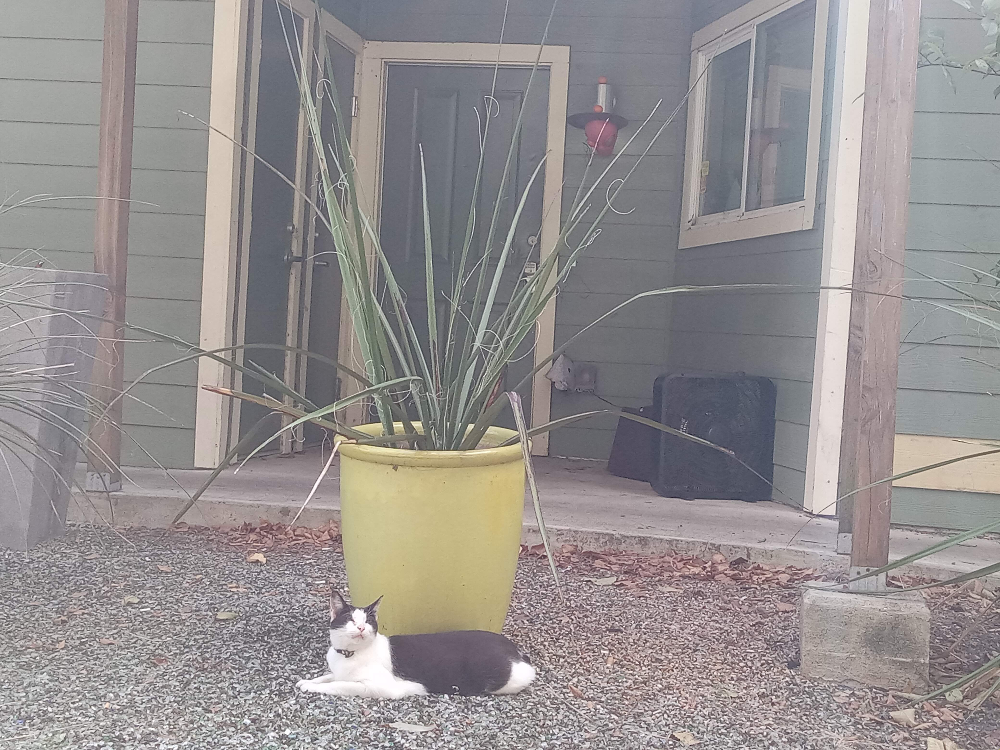

# Whispers in the Amazon's Shadow

In the heart of the Amazon rainforest, where ancient secrets whispered through the dense canopy, Dr. Elena Hart moved with practiced ease alongside her guide Marco. The air was thick and heavy, filled with the symphony of unseen creatures and the distant roar of a waterfall echoing like a mysterious drumbeat. Sunlight filtered through the leaves above, casting dappled shadows that seemed to dance in time with their steps.

Marco suddenly halted, his hand shooting up in a silent command. Elena's heart quickened as she strained to listen. There it was—a faint rustling, too deliberate to be natural. Someone—or something—was following them.

“What is it?” Elena whispered, her voice barely audible over the chorus of wildlife.

Marco’s eyes narrowed as he scanned the shadows. “We’re not alone,” he murmured, his tone grave and measured.  They continued cautiously, every sense heightened. The forest seemed to close in around them, the usual comforting sounds now echoing with foreboding whispers.

Suddenly, Marco froze again. This time, Elena saw it too—a flash of movement ahead. A low growl echoed through the trees, sending a jolt of adrenaline through her veins. She knew that sound—it was a jaguar.  Marco drew his knife, a wicked blade that gleamed even in the dim light.

“Stay behind me,” he ordered, his voice steady but firm.

Elena nodded, moving closer to him as she gripped her machete tighter, feeling the cool metal grounding her. The jungle seemed to hold its breath as they waited. The growl came again, louder this time, and Elena could feel the beast’s eyes on them, unseen but palpable. Marco drew his knife, a wicked blade that gleamed even in the dim light.

“If it attacks, we fight together,” he said.

Elena took a deep breath, steeling herself for what was to come. The tension was almost unbearable, and then, just as suddenly as it had begun, the growling stopped. A figure emerged from the shadows—a man, his face painted with intricate patterns, holding a spear tipped with a gleaming stone point. He stepped forward, his eyes locked on Marco and Elena.

“Who are you?” Marco demanded, his grip on the knife tightening.

The man spoke in a language Elena didn’t recognize, but the tone was clear—he meant them no harm yet there was an underlying sense of urgency that made Elena uneasy.  The tension remained, a coiled snake ready to strike at any moment. Their encounter with this mysterious figure left Elena pondering: What secrets did this man hold? And what lay deeper within the heart of the jungle, waiting to be discovered—or to discover them?

The dense forest seemed to close in around them, but their steps were firmer than ever as they pressed on towards the unknown.  This encounter with a stranger in the wild was just the beginning of something far more dangerous and mysterious.

## Choices

* [Continue the adventure](./20221012_145451.md)
* [Continue the adventure](./20221013_144240.md)
* [Continue the adventure](./20221113_161540.md)

---
*Generated with AI assistance*
