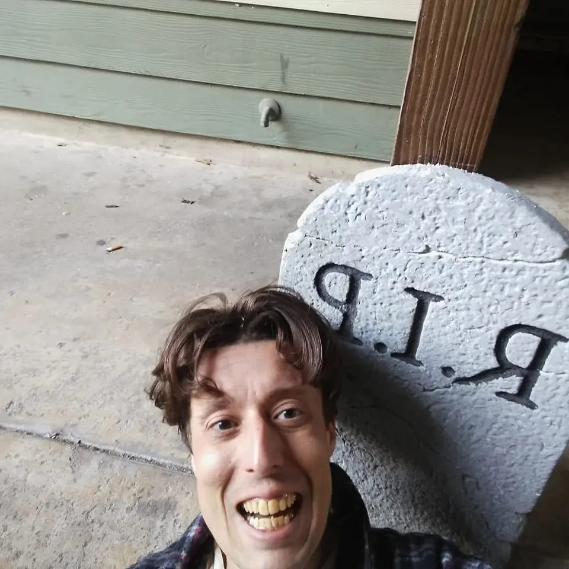

# Whispers in the Amazon Night

In the heart of the dense Amazonian jungle, shadows danced eerily as the moonlight filtered through the canopy above. The air was thick with humidity and the scent of ancient secrets hidden beneath the verdant foliage. Dr. Elena Hart, a renowned archaeologist, stood at the entrance of a long-abandoned temple, her heartbeat pounding in her ears like the rhythmic drums of a forgotten tribe.

"Stay alert," she whispered to Marco, her trusted guide with an uncanny knack for sensing danger. "This place has been untouched for centuries."

Marco nodded, his flashlight cutting through the darkness as they stepped into the temple. The walls were adorned with intricate carvings of mythical beasts and long-forgotten deities, each one a testament to the legend of Zora. Elena's fingers traced the cold stone, feeling the history etched into every groove.

Suddenly, Marco froze. "Listen," he murmured, his voice barely audible. A faint echo resonated from deeper within the temple—a low hum that seemed to vibrate through the very ground beneath their feet.

Elena's eyes widened in alarm. "We're not alone."

They exchanged a glance, their breaths coming in short gasps as they cautiously moved forward. The sound grew louder, more ominous. It was a rhythmic chanting, ancient and haunting, sending shivers down their spines.

As they rounded a corner, they saw it—a hidden chamber bathed in an eerie green light. At the center stood a group of cloaked figures, their voices rising and falling in unison as they performed some dark ritual. In their midst was a pedestal holding a glowing artifact, its surface pulsating with raw energy.

Elena's mind raced. "We need to stop them," she whispered urgently. "Whatever they're doing, it can't be good."

Marco nodded grimly. "On my count." They exchanged another glance and then sprang into action, charging towards the cloaked figures with a ferocity born of desperation.

Chaos erupted as the intruders clashed with the guardians. The chanting faltered, replaced by shouts and the clash of metal on stone. Elena's focus was solely on the artifact; she had to reach it before it was too late.

With a final surge of adrenaline, she leaped over a fallen guardian and snatched the glowing orb from its pedestal. It pulsed in her hand, its energy coursing through her veins like liquid fire. She turned to Marco, who was fending off two attackers with surprising agility.

"Marco, we have to go!" she shouted, her voice echoing through the chamber.

Marco nodded, a grim smile on his face as he dispatched his final opponent. Together, they fled back through the temple, their hearts pounding in tandem with the rhythm of their footsteps. The chanting faded behind them, but the echo of ancient power lingered, a harbinger of the battles yet to come. As they emerged into the moonlight, Elena couldn't shake the feeling that this was just the beginning—a prelude to a much larger and more sinister plot.

Their journey had only begun, and the path ahead was shrouded in mystery, fraught with danger, and filled with the echoes of forgotten legends.

## Choices

* [Continue the adventure](./books 015.JPG)
* [Continue the adventure](./20221113_161556.md)

---
*Generated with AI assistance*
