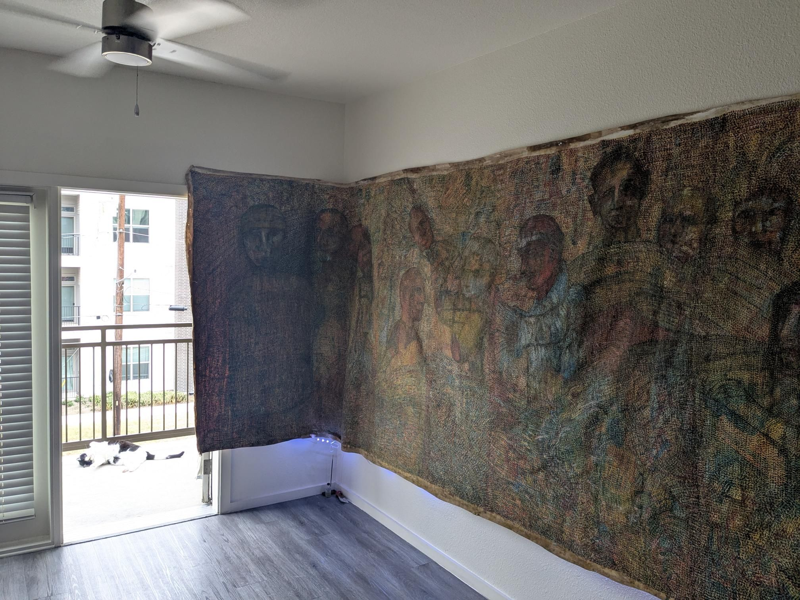

# Whispers in the Amazon Shadows

In the heart of the Amazonian jungle, dense foliage choked out most of the sunlight, leaving only dappled shadows and the ever-present hum of unseen life. Dr. Elena Hart picked her way through the underbrush, her flashlight illuminating twisted roots and tangled vines. She could feel it—the ancient city of Zora was within reach.

Marco, her knowledgeable guide, kept pace behind her, his voice a low whisper, "We must be cautious, Doctor. The guardians of this place are said to protect their secrets with great ferocity."

Elena's heart raced with anticipation and the thrill of discovery. Years of poring over ancient texts and deciphering cryptic maps had led her here. Zora, the legendary lost city, was rumored to hold an artifact that could rewrite history.

As they neared a clearing, the ground began to tremble gently. Elena's flashlight beam revealed intricate stone carvings etched into the walls of a hidden temple. The patterns pulsed with an almost tangible energy, and her excitement surged. "We're here," she breathed.

Marco’s voice was barely audible over the distant drumming that echoed through the jungle. "Doctor, we should not enter. The guardians will awaken."

Elena hesitated briefly but pushed forward, guided by a mix of bravery and determination. She stepped into the clearing where the temple loomed ominously, its massive doors covered in symbols that matched those from her research.

Suddenly, a low rumble reverberated through the jungle, and the ground shook more intensely. Elena's flashlight flickered as she hurried to the entrance, her fingers tracing the ancient symbols. Marco’s warnings echoed in her mind, but she couldn’t turn back now—they had come too far.

With a deep breath, she pushed against the doors, feeling them give way with a grinding roar. The temple opened before her, revealing a dark chamber filled with shadows and secrets. As she stepped inside, the rumbling stopped abruptly, leaving only an eerie silence.

Elena felt a chill as she realized she was not alone in the darkness. Cloaked figures emerged from the shadows, their faces obscured by masks adorned with symbols that matched those on the temple walls. Her hand reached for her flashlight, but it was too late—they had been anticipated.

One of the cloaked figures stepped forward, its voice a low growl, "Who dares to disturb the slumber of Zora?"

Elena braced herself, knowing that whatever lay ahead would test every ounce of her courage and skill. But she had come this far, and there was no turning back now—whether it meant facing the guardians through combat or negotiation, they were ready for any challenge.

The path before them branched into multiple shadows, each leading to new mysteries and potential dangers, but Elena Hart knew that every step forward brought them closer to uncovering the true secrets of Zora.

## Choices

* [Continue the adventure](./476485484_1684131429201363_7550930141077594240_n.md)
* [Continue the adventure](./20221013_174915.md)

---
*Generated with AI assistance*
