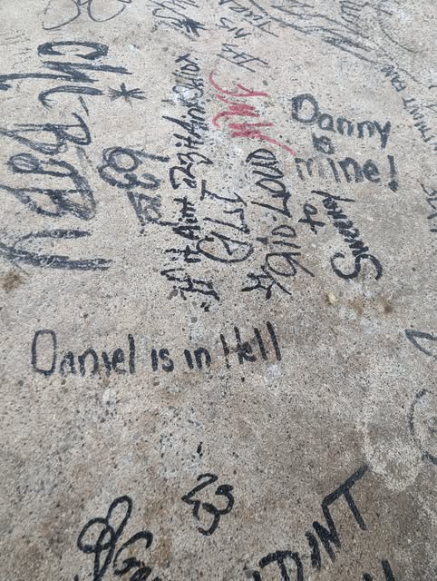

# Whispers in the Amazon Shadows

In the oppressive heart of the Amazon rainforest, the air was heavy with moisture and the rich scent of ancient earth. The sunlight barely pierced the dense canopy above, casting eerie shadows on the forest floor as Dr. Elena Hart and her team ventured deeper into the unknown. Their guide, Marco, a local expert, led them with unerring precision.

Elena's pulse quickened as she wiped sweat from her forehead. She clutched an ancient map, its edges worn from years of secrecy. The legend of Zora, a lost city hidden within this vast wilderness, was their driving force, and they were close—she could sense it.

"Marco," Elena whispered, her voice barely audible over the cacophony of wildlife, "how much further?"

Marco glanced back at her, his eyes reflecting the mysterious glow of the forest. "Not far, Dr. Hart. The city is just beyond that ridge."

As they ascended a steep hill, the undergrowth thinned, revealing the ruins of an ancient temple. The stone structures were overrun with moss and vines, their grandeur partially reclaimed by nature.

"We're here," Marco announced softly, his voice tinged with reverence.

Elena's eyes widened as she took in the sight. The city was more magnificent than she had ever imagined. She turned to her team, "Be cautious. This is what we've come for."

As they approached the main entrance, an unsettling rustling echoed through the ruins. A group of cloaked figures, their faces obscured by masks and armed with machetes and guns, emerged from behind the stone columns.

"Stay back!" one of them shouted, his voice cold and menacing.

Elena's blood chilled. "Who are you?" she demanded, her heart pounding.

The figure stepped forward, a cruel smile on his lips. "We guard what you seek."

Marco tensed beside Elena, his hand moving towards the knife at his side. The standoff was tense, the air thick with anticipation and danger.

Elena's mind raced as she calculated their options. They were outnumbered and outgunned, but they couldn't give up now. Not after everything they had sacrificed to get here.

She met Marco's gaze, a silent understanding passing between them. This wasn’t over yet. With a deep breath, Elena stepped forward, her voice steady despite the fear gripping her heart.

"What do you plan to do with it?" she asked, buying time for a plan to form.

The figure laughed, a chilling sound that echoed through the ancient ruins. "We have our own plans."

As the tension reached a breaking point, Elena knew they had to act quickly. The fate of Zora and their expedition hung in the balance, and every second counted. Whether they would face this threat head-on or find another way around it remained uncertain, but one thing was clear: their journey was far from over.

## Choices

* [Continue the adventure](./20221014_134512.md)
* [Continue the adventure](./20221113_161248.md)
* [Continue the adventure](./463314582_8751461421614883_6093502764820900015_n.md)

---
*Generated with AI assistance*
