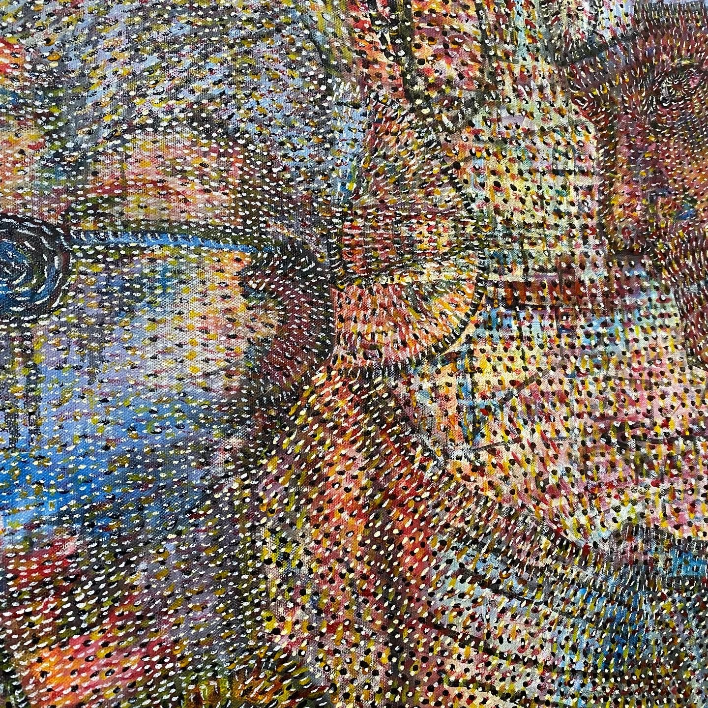

# **"Jungle's Eerie Embrace"**

In the heart of the dense, mist-laden Amazonian jungle, Dr. Elena Hart hacked her way through the tangled undergrowth, machete in one hand, flashlight casting eerie shadows in the other. The air was thick with humidity and the scent of decaying leaves, while the symphony of unseen creatures echoed around her. She had been tracking the legendary city of Zora for weeks, guided by cryptic clues from an ancient map.

As she reached a clearing, the ground suddenly gave way beneath her foot. She stumbled forward, catching herself just in time to avoid falling into a deep pit hidden by overgrown vines. Her heart pounded as she shone her flashlight down into the darkness. The walls of the pit were adorned with strange carvings that seemed to pulse with an eerie energy.

"Elena?" came a whispered voice from behind her. She turned to see Marco, their guide, his face etched with concern. "Are you okay?"

"Yes," she replied, trying to keep her voice steady. "But we need to be more cautious. This place... it feels different."

Marco nodded grimly and pulled out his own flashlight, casting twin beams into the abyss.

"This is what we've been looking for," Elena said, her excitement battling with her caution. "We have to go down there. This could be our entry point to Zora."

Marco hesitated before nodding in agreement. They carefully lowered themselves into the pit using ropes, the sound of their descent echoing ominously around them. The carvings on the walls seemed to grow more intricate and menacing as they descended deeper.

At the bottom, Elena's flashlight illuminated a massive stone door covered in symbols she had only seen in ancient texts. She reached out, her fingers tracing the cool surface of the stone. A low rumble reverberated through the ground, and the door began to move.

"Elena," Marco warned, his voice barely above a whisper. "We should be cautious."

But Elena was already stepping forward, her eyes wide with anticipation and fear. As the door slid open, revealing a dark chamber beyond, she knew they were standing on the precipice of something extraordinary—and potentially deadly. The faint sound of drums echoed through the chamber, adding to the mysterious atmosphere.

Inside the chamber, shadows danced menacingly as if alive. Elena took a deep breath, steeling herself for whatever lay ahead. This was just the beginning; there was no turning back now. The adventure had only begun, and the true mysteries of Zora were yet to be uncovered.

As they stepped into the chamber, Elena's mind raced with possibilities—would they encounter ancient guardians or face new dangers? Only time would tell as they delved deeper into the heart of the Amazon, guided by their determination and the legends that had brought them here.

## Choices

* [Continue the adventure](./289641143_5461602423934149_1613512193125880228_n.md)
* [Continue the adventure](./B0BHLH14NQ.01._SCLZZZZZZZ_SX500_.md)

---
*Generated with AI assistance*
