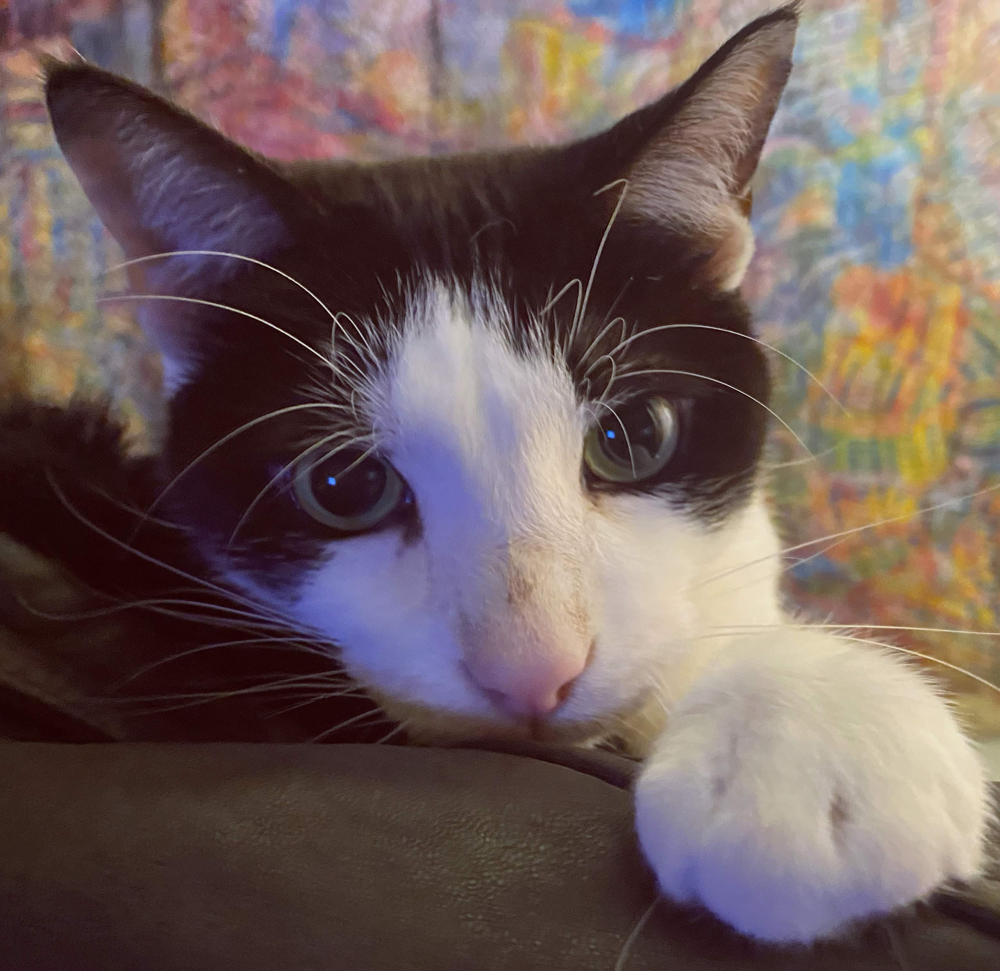

# **"Jungle's Hidden Secret"**

In the heart of the dense, verdant Amazonian jungle, Dr. Elena Hart moved swiftly through the undergrowth, her breath steady despite the weight of the ancient map clutched to her chest. The air was thick with humidity and the scent of decaying foliage, while the cacophony of unseen creatures echoed around her, a symphony of danger and mystery.

"Elena! Wait!" called out Marco, her trusted guide, his voice steady as he navigated the tangled vines behind her.

"We're close to Zora," Elena replied, her eyes scanning the dense foliage for any sign of the legendary city. "We can't afford to stop."

The ground trembled slightly beneath their feet, sending a chill down Elena's spine. She knew they weren’t alone in this perilous quest; the jungle held ancient secrets and hidden dangers.

"Did you feel that?" Marco asked, his hand resting on the hilt of his machete.

Elena nodded, her senses heightened. "We need to keep moving."

As they pressed on, the jungle seemed to close in around them, the trees growing denser and the shadows darker. Suddenly, Elena stopped dead in her tracks, her heart pounding wildly as she stared at a pair of glowing eyes hidden among the branches.

"Marco?" Elena whispered, her voice barely audible.

"Stay alert," Marco murmured, his grip tightening on his machete. "This is not our only obstacle."

The jungle fell silent, as if holding its breath. Then, with a sudden burst of movement, several cloaked figures emerged from the shadows, their faces hidden behind eerie masks. They blocked the path ahead, their presence both ominous and enigmatic.

Elena's mind raced as she tried to decipher the symbols on the ancient map, hoping they would provide some clue about these guardians. She slowly reached into her backpack, pulling out a small artifact—a relic from her previous expeditions—that she hoped might grant them safe passage.

"Marco," Elena whispered, "we need to tread carefully. On three, we approach."

Before she could count to three, the cloaked figures began to chant in unison, their voices low and resonant. The drumming sound of ancient rhythms echoed through the jungle, creating an atmosphere of awe and foreboding.

Elena and Marco exchanged a glance, knowing that if they didn't find a way past these guardians soon, this thrilling adventure might end before they even reached Zora's gates.
    - The choice to face or avoid the cloaked figures
    - How they will navigate the mysterious rituals of the jungle guardians

## Choices

* [Continue the adventure](./20221112_132825.md)
* [Continue the adventure](./20221013_140920.md)

---
*Generated with AI assistance*
