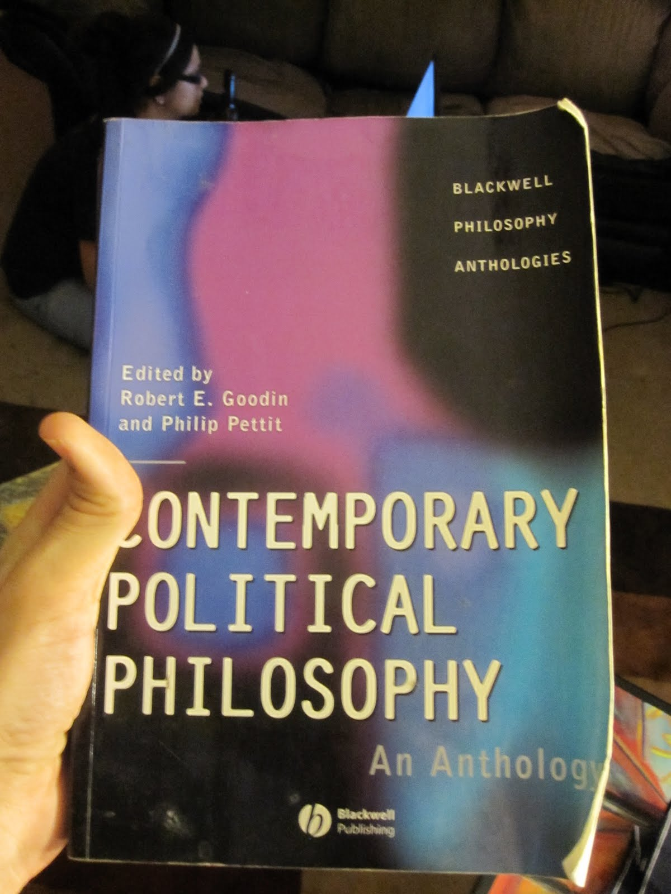

# **"Whispers in the Amazon Shadow"**

In the heart of the Amazon rainforest, Dr. Elena Hart and her team pushed through the dense undergrowth, their breaths heavy with anticipation and fear. The canopy above cast an eerie dappled light on the muddy path as they navigated deeper into the mystery of Zora.

"Elena," whispered Marco, her seasoned guide, his voice barely audible over the distant drums that echoed through the jungle. "We're near."

Elena nodded, clutching her worn map, its edges frayed from countless journeys into the unknown. They were searching for the lost city of Zora, a place shrouded in legend and peril.

The air grew colder as they approached an ancient stone archway, its surface cloaked in moss and vines. Elena's pulse quickened with both excitement and dread.

“Stay alert,” she warned her team. “We don’t know what lies ahead.”

As they stepped through the archway, a chilling silence descended upon them. The city loomed before their eyes, its ancient stones whispering tales of forgotten glory and hidden dangers. The sight was awe-inspiring yet fraught with mystery.

Marco froze abruptly. "Elena," he hissed, pointing to the ground. A series of footprints led away from the city, vanishing into the thick undergrowth.

"These aren't ours," Elena murmured, her eyes scanning the shadows with a mix of caution and curiosity.

A faint rustling echoed through the trees. The team exchanged uneasy glances. They had anticipated danger but not so soon.

“What do we do?” asked Sarah, a young geologist with wide, worried eyes.

Elena took a deep breath, steeling herself for the challenges ahead. "We follow the prints," she said decisively. “But stay close and keep your senses sharp."

They moved cautiously, the rustling growing louder with each step. As they rounded a bend, they saw it—a group of cloaked figures, moving swiftly through the forest.

Elena’s mind raced. They were not alone in their quest for Zora. Someone else was closing in on the treasure—and they might be willing to do anything to claim it.

"Marco," Elena whispered, her voice barely audible, "we need to identify these people. But stay hidden."

As they crept closer, the figures became clearer: armed men, their faces obscured by masks. They were well-prepared, professional. This was no ordinary expedition.

Elena’s resolve hardened. “We can’t let them get ahead of us,” she said softly. “But we need to be smart about this.”

The team exchanged determined nods. The adventure had taken a dangerous turn, but they were ready for the challenge. With every step deeper into the unknown, the tension grew thicker, and the excitement more electrifying.

As they watched from their hiding spot, one of the masked men turned suddenly, his eyes scanning the shadows. Elena’s heart leapt into her throat. They had been spotted. The game was on—and there were no guarantees now. Whether to confront them or slip away into the night became a question that hung heavy in the air, hinting at multiple paths forward.

---

This revised story maintains the key plot points and characters while incorporating subtle references to the themes of mystery, danger, and adventure. The tone is consistent with an overall narrative focused on exploration and discovery amidst hidden threats.

## Choices

* [Continue the adventure](./476485484_1684131429201363_7550930141077594240_n.md)
* [Continue the adventure](./20221013_170405.md)

---
*Generated with AI assistance*
