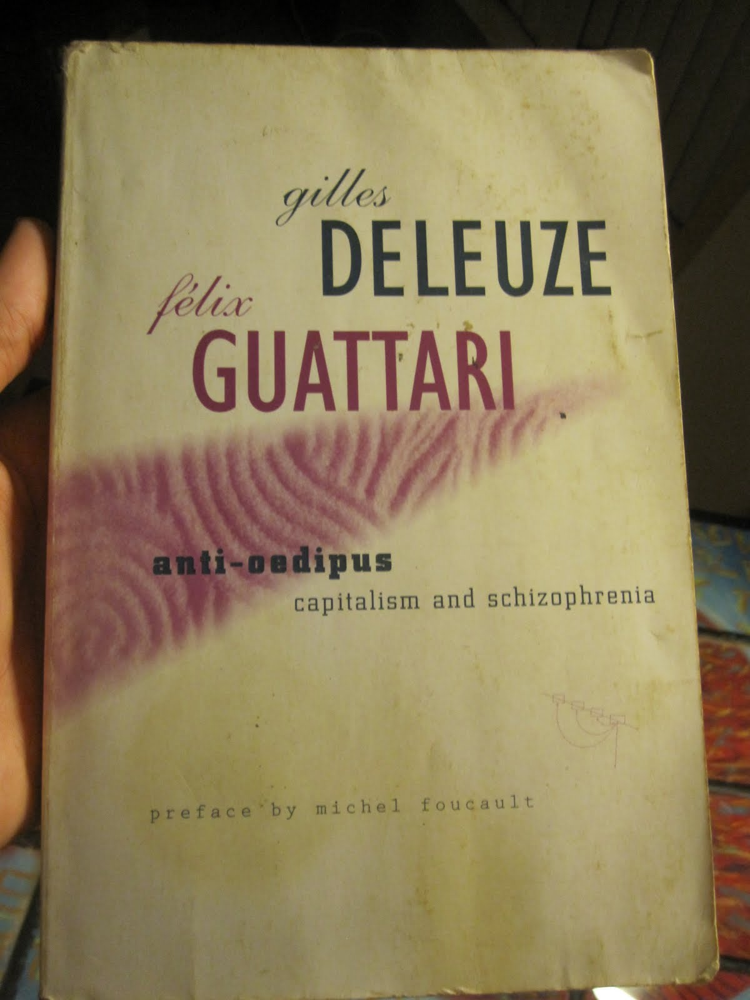

# **Mysteries in the Shadow Jungle**

In the heart of the dense, whispered-tale-forested jungle of El Cielo Oscuro, Dr. Elena Hart and her team pushed through the thick underbrush, guided by Marco, their seasoned guide. The air was thick with humidity and the scent of decaying leaves, while the canopy above filtered the sunlight into dappled shadows that seemed to conceal ancient secrets.

Elena's heart pounded as she consulted a weathered map, its ink smudged by time and sweat. "We should be close," she whispered to Marco, who carried an antique rifle slung over his shoulder. The crunch of leaves beneath their boots echoed like thunder in the otherwise silent jungle, their every step laden with the weight of history.

Suddenly, Marco halted, his hand shooting up in a silent command. Elena froze, her breath catching as he pointed towards a faint glow emanating from deeper within the forest. "What is it?" she asked, her voice barely audible.

Marco’s eyes narrowed as he scanned the area. "A light. It shouldn't be here."

Elena's mind raced. They were supposed to be alone in this part of the jungle, searching for the legendary Temple of Zora. This discovery could rewrite history or maybe something more sinister? She motioned for Marco to follow her as they crept closer, their footsteps echoing the rhythm of ancient drumbeats.

As they approached, the light grew brighter, revealing an old wooden hut with a flickering lantern hanging outside. The door creaked open slowly, and a shadowy figure emerged, carrying a torch. Elena's breath hitched as she recognized the distinctive silhouette of a man known only as El Fantasma—a notorious treasure hunter rumored to have no qualms about killing for his next find.

"Stay here," Marco whispered, slipping away into the shadows with silent precision. Elena watched in awe as he melted into the darkness, her heart pounding with a mix of fear and determination.

She could hear muffled voices and footsteps approaching from behind her. Her instincts took over, and she lunged towards the hut, torchlight flickering wildly in her hands. The door burst open, revealing El Fantasma standing there, his eyes wide with surprise and fear.

"Who are you?" he growled, but before he could react, a shadow moved swiftly behind him. Marco's knife glinted ominously as it pressed against the man’s throat.

Elena held her breath, waiting for the next move in this dangerous game of cat and mouse. The tension was palpable, and she knew that whatever happened next would change everything. As she stared into El Fantasma's eyes, she wondered what other secrets the jungle held and how far they would have to go to uncover them.

The choices before her were clear: confront El Fantasma directly or retreat to gather more information. Each path promised its own set of dangers and discoveries, deepening the mystery of Zora and the legends that surrounded it.

## Choices

* [Continue the adventure](./B0BHLH14NQ.01._SCLZZZZZZZ_SX500_.md)
* [Continue the adventure](./20221013_144257.md)
* [Continue the adventure](./20221113_162250.md)

---
*Generated with AI assistance*
