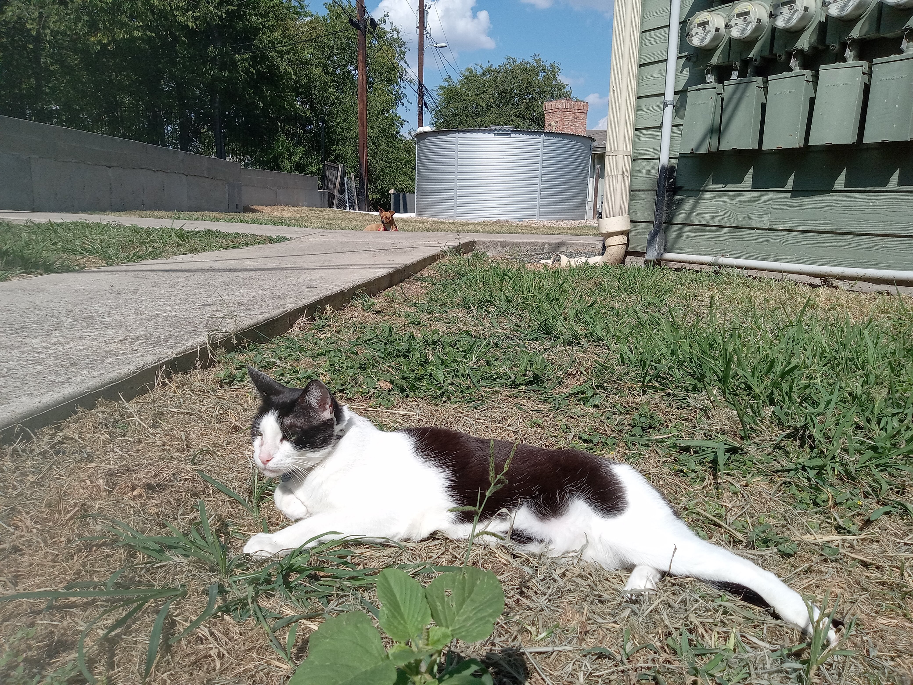

# **"Secrets in the Shadows"**

In the depths of the Amazonian jungle, where the air was thick with humidity and the scent of ancient mysteries, Dr. Elena Hart pushed through the dense underbrush. The canopy above filtered the sunlight, creating dappled shadows that seemed to whisper secrets from a bygone era. She was on a quest for Zora, following a map shrouded in legend, leading her to this uncharted corner of the world.

Her guide, Marco, a seasoned explorer with a weathered face and eyes that held the wisdom of the jungle, suddenly halted and raised his hand. "Listen," he whispered, his gaze scanning the foliage intently. Elena strained her ears, hearing only the usual symphony of jungle sounds—chirping birds, rustling leaves, and distant animal calls.

"Did you hear that?" Marco asked, his voice barely audible over the natural din.

Elena shook her head, but before she could respond, a sudden crack echoed through the trees. Marco's eyes widened as he pushed Elena to the ground just as an arrow whizzed past them. It was followed by another and then another—a barrage of arrows that tore through the foliage with lethal precision.

"Ambush!" Marco shouted, rolling onto his back and drawing his machete. "We need to move!"

Elena's heart raced as she scrambled to her feet, grabbing her backpack. They dashed through the undergrowth, dodging fallen trees and vines that snagged at their ankles. The sound of pursuit was close behind—the thudding footsteps and guttural cries of their attackers.

"Who are they?" Elena panted, her breaths short and sharp.

Marco's expression was grim. "Whoever they are, they're well-armed and know this jungle like the back of their hand."

They burst into a clearing, the sudden openness disorienting after the dense foliage. A river flowed nearby, its waters churning over rocks. Marco pointed towards it. "The river! It'll confuse their trail."

As they splashed into the water, Elena risked a glance back and saw figures emerging from the tree line—a group of heavily armed men, their faces painted with eerie patterns. The sight sent a chill down her spine; these were not ordinary bandits but guardians of some ancient secret.

"Keep moving!" Marco urged, his voice urgent as he pulled her along the swift current. They were far from safe, but for now, the river provided a temporary reprieve. The question remained: who were these attackers, and what did they guard that was worth dying for?

As they disappeared around a bend, Elena couldn't shake the feeling that this was only the beginning of their perilous journey into the heart of legend and danger. Ahead lay the unknown, where ancient mysteries and hidden treasures awaited discovery—or perhaps, a deadly end.

## Choices

* [Continue the adventure](./20221010_111253.md)
* [Continue the adventure](./20221113_162250.md)
* [Continue the adventure](./77082571-3717-4590-9131-5212AB1ACCAA.md)

---
*Generated with AI assistance*
