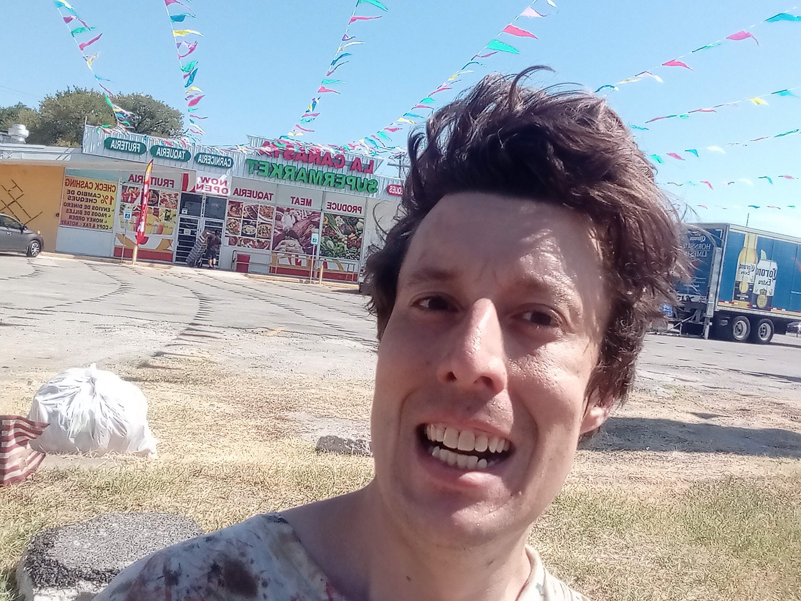

# **"Whispers in the Amazon's Shadow"**

In the dense heart of the Amazon rainforest, the air was thick with humidity and the cacophony of unseen creatures. Dr. Elena Hart, a seasoned archaeologist, led her team through the tangled undergrowth, their flashlights cutting through the perpetual twilight. The scent of damp earth and decay mingled with the pungent aroma of exotic flowers.

"Stay close," Elena whispered, her voice barely audible over the rustling leaves. "We don't want to get separated."

Suddenly, Marco, her most trusted guide, froze in his tracks. "Did you hear that?" he asked, his hand instinctively reaching for his machete.

Elena paused, listening intently. A faint, rhythmic tapping echoed through the forest—too steady to be natural. Her pulse quickened as she signaled for everyone to stay quiet. The sound grew louder, more insistent. It seemed to come from all directions at once, enveloping them in a disorienting symphony.

The team exchanged nervous glances, their breaths shallow and rapid. Elena knew the legends of Zora—an ancient city hidden deep within the jungle—and this eerie rhythm could be part of its mysterious defenses.

"We need to move," Elena urged, her voice firm despite the fear knotting in her stomach. "Follow me."

They pressed on, hearts pounding in sync with the mysterious rhythm. The forest seemed to close in around them, the trees bending like skeletal fingers trying to grasp at their heels. The tapping intensified, now a deafening drumbeat that vibrated through the ground.

As they rounded a bend, they stumbled upon an ancient stone temple, its walls covered in moss and vines. The sound was louder here, pulsing from deep within the structure. A shiver ran down Elena's spine as she realized what it was—an ancient warning system triggered by their intrusion. Cloaked figures with masks stood at the entrance, guarding the sacred site.

"Someone—or something—doesn't want us here," Marco murmured, his eyes wide with a mix of awe and terror.

Elena took a deep breath, steeling herself for what lay ahead. "We came this far for a reason. Let's find out why."

With a determined nod, she led the team into the temple, the drumbeat echoing ominously behind them. The darkness within seemed to swallow their flashlights, but Elena pressed on, knowing that whatever secrets Zora held could change everything—if they survived long enough to uncover them.

As they ventured deeper, Elena wondered if the cloaked figures were guardians or enemies and whether they would have to fight or negotiate their way through. The path ahead was unclear, but her resolve remained unwavering; she had come too far to turn back now.

## Choices

* [Continue the adventure](./463893960_8751402418287450_1246655841173803972_n)
* [Continue the adventure](./20221013_140515)

---
*Generated with AI assistance*
