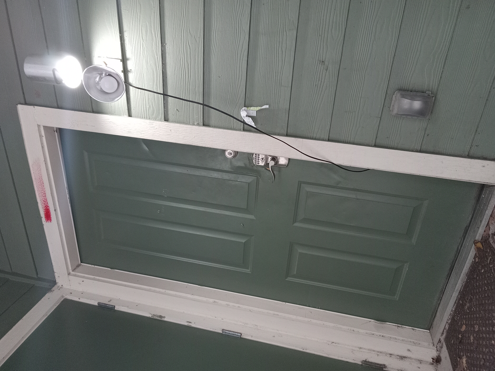

# **Jungle Pulse: Unseen Depths**

In the dense heart of the Amazon rainforest, Dr. Elena Hart and her team hacked through the thick undergrowth, their breaths ragged and hearts pounding like ancient drums echoing through the jungle. The air was thick with humidity and the scent of decaying vegetation, punctuated by the distant calls of unseen creatures. They had been following a mysterious map for days, and now, they were finally approaching the legendary Temple of Zora.

Elena's guide, Marco, held up his hand abruptly, signaling silence. "We're close," he whispered, his eyes scanning the dense foliage. The team exchanged nervous glances but pressed on, their footsteps muffled by the soft earth.

As they rounded a bend, the temple loomed before them, its ancient stone walls covered in moss and vines. The entrance was guarded by two cloaked figures with masks, their presence both eerie and intimidating. Elena's pulse quickened as she stepped forward, her flashlight beam dancing over the intricate carvings on the temple walls.

Suddenly, a low rumble echoed through the chamber. The ground beneath them trembled, and the cloaked guardians began to move, their masked faces seeming to follow the intruders with an unsettling intensity. Panic surged through the team, but Elena remained focused.

"Stay calm," she ordered, her voice steady despite the fear gripping her chest. "We need to figure out how to proceed."

Marco pulled out a small device from his backpack and pointed it at the guardians. The rumbling intensified, and the cloaked figures started to coalesce around each other, blocking their exit.

"Elena, what do we do?" one of her team members shouted over the din.

She took a deep breath, recalling ancient texts she had studied for years. "We need to find the heart of the temple," she said, her eyes scanning the walls for any hidden symbols or mechanisms. The legends spoke of trials and tribulations that would test their resolve, but they were prepared to face whatever came their way.

As they frantically searched, the guardians began to close in, their movements grinding against each other with a deafening roar. The air grew colder, and an eerie mist filled the chamber. Elena's heart raced as she realized they were running out of time.

Just as the guardians seemed about to engulf them, Marco shouted, "Found it!" He pointed to a hidden panel on the wall, and with trembling hands, Elena activated the mechanism. The ground shook violently, and the guardians recoiled, revealing a narrow passageway leading deeper into the temple.

Elena looked at her team, their faces pale but determined. "We have to keep going," she said, her voice resolute. "Whatever is down there holds the key to unlocking the secrets of Zora."

With renewed vigor, they plunged into the darkness, leaving behind the ominous guardians and stepping further into the unknown dangers that awaited them in the heart of the Temple of Zora. The path ahead was shrouded in mystery, but Elena knew that the legends of old spoke of treasure and knowledge beyond their wildest dreams, waiting for those brave enough to seek it.

## Choices

* [Continue the adventure](./476485520_618748147579301_2628358660310613573_n)
* [Continue the adventure](./20221013_144257)

---
*Generated with AI assistance*
