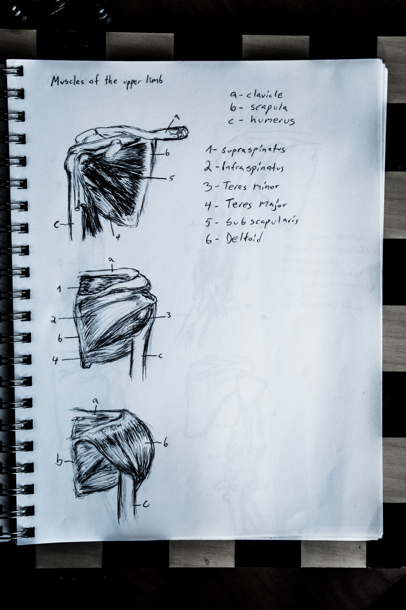

# Shadows of the Amazon Heart

In the dense heart of the Amazon, Dr. Elena Hart hacked her way through the tangled foliage, the air thick with humidity and the scent of ancient earth. The sun was barely visible through the canopy above, casting eerie shadows that seemed to shift with every step. Her heart beat in time with the distant drumming of the jungle, a primal rhythm that spurred her onward.

Her guide, Marco, moved with practiced ease through the treacherous terrain. He suddenly stopped, raising his hand in caution. "We're close," he murmured, his eyes scanning the overgrown path ahead.

Elena's breath caught as she saw it—a hidden entrance, half-buried under moss and vines. It appeared to be a portal to another time, reclaimed by nature but still holding echoes of its ancient glory. The air buzzed with anticipation as they stepped inside.

The temple was a maze of shadows and whispers, the walls adorned with intricate carvings that told tales of forgotten battles and lost deities. Elena traced the grooves with her fingers, feeling the weight of history beneath her touch. Her mind raced with the legends surrounding Zora. Marco lit torches, their flickering light casting eerie patterns on the stone.

"Stay close," Marco warned, his voice a low whisper over the silence. "The temple is said to be guarded."

Elena nodded, her pulse quickening as they ventured deeper into the ruin. The air grew colder, heavier with age. Suddenly, a deep rumble echoed through the corridors.

Marco's eyes widened in alarm. "We need to go!" he shouted, grabbing Elena’s arm and pulling her back toward the entrance.

As they ran through the labyrinthine halls, the ground shook violently. Stones fell from above, choking the air with dust. Elena coughed, struggling to keep pace as Marco led them out. The exit seemed impossibly distant, the temple collapsing around them like a living entity defending its secrets.

With a final surge of speed, they burst through the entrance just as it crumbled behind them, sealing off their escape route. Elena gasped for breath, her eyes wide with shock and exhilaration. They had survived, but what lay ahead was shrouded in mystery.

Marco looked at her, his expression grave. "We must keep moving," he said, his voice heavy with unspoken thoughts. "There are deeper mysteries here than we can see."

Elena nodded, her mind a whirlwind of questions. What secrets did the ruins hold? And who—or what—had triggered those deadly traps?

As they disappeared back into the jungle, the drumbeat of adventure resonated in their hearts, pushing them forward into the unknown. The path ahead could lead to further dangers or hidden treasures, but one thing was certain: their journey through the mysteries of Zora had only just begun.

## Choices

* [Continue the adventure](./B0BHLH14NQ.01._SCLZZZZZZZ_SX500_)
* [Continue the adventure](./20221014_111722)

---
*Generated with AI assistance*
