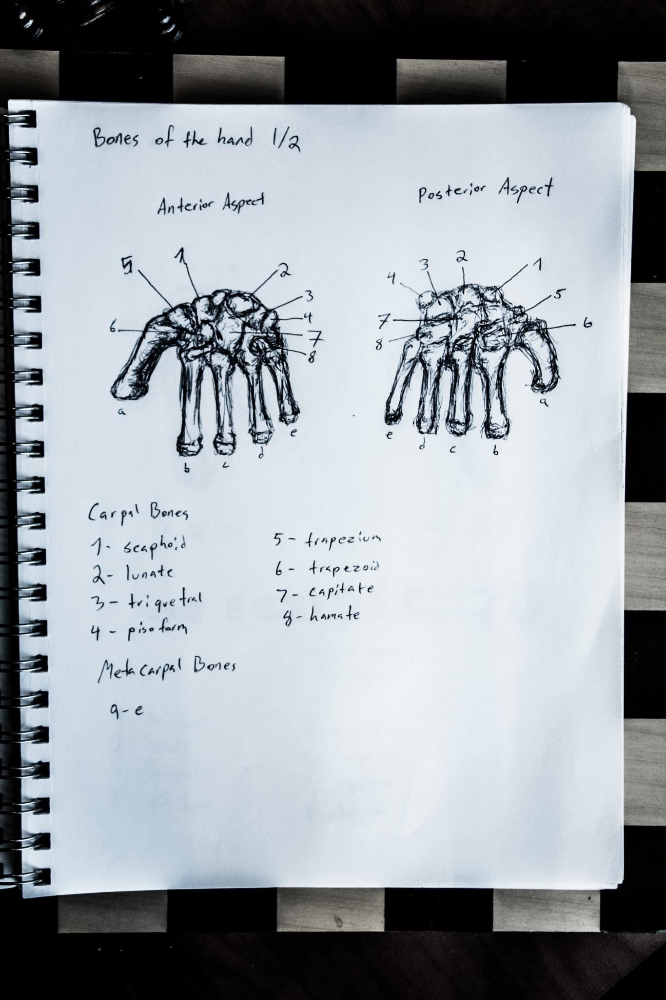

# **"Shadows of the Lost Temple"**

In the heart of an ancient, crumbling temple, hidden deep within the dense Amazonian jungle, Dr. Elena Hart and her team huddled together, their breaths visible in the cool, damp air. The only light came from their flashlights, which cast eerie shadows on the moss-covered walls.

"Keep moving," Elena whispered urgently, her eyes scanning the darkness ahead. "We're close to Zora."

Suddenly, a faint rumble echoed through the temple, sending shivers down their spines. The ground trembled slightly, and a cloud of dust billowed from the ceiling.

"What was that?" Marco, the team's guide, asked, his voice barely audible over the sound of distant stones grinding together.

Elena paused, her heart pounding in her chest. "I don't know. But we need to keep going."

They pushed forward, their footsteps echoing through the vast chamber. The air grew thicker with each step, and the sense of foreboding was palpable. As they rounded a corner, they came face-to-face with an enormous stone door covered in intricate carvings.

"This is it," Elena said, her voice shaking slightly. "The entrance to Zora."

With trembling hands, she reached out to touch the door. As soon as her fingers made contact, the rumbling intensified, and the ground shook violently beneath them. The stone door began to move, revealing a narrow passageway beyond.

"What have you done?" Marco cried out in alarm.

Elena didn't respond; instead, she grabbed her flashlight and stepped into the passageway without hesitation. Her team exchanged nervous glances but followed closely behind.

The passageway was dark and twisted, leading them deeper into the heart of the temple. The rumbling continued, growing louder and more ominous with each step. As they reached a fork in the path, Elena paused again, her instincts telling her something was wrong.

"Elena," Marco whispered urgently, "we need to turn back."

Before Elena could respond, the sound of heavy footsteps echoed through the darkness. Someone—or something—was approaching from both directions. The temple seemed to come alive with danger, its ancient secrets threatening to consume them all.

"We're not alone," Elena hissed, her grip tightening on her flashlight. "Stay close and keep moving."

As they hurried down the left fork, the sounds behind them grew louder, more menacing. Their only hope was to find a way out before it was too late. The tension was palpable as they raced against time and an unseen adversary. They had come seeking the legends of Zora, but now they were fighting for their lives in the depths of a hidden world.

The path ahead split again, presenting them with new choices and dangers. Elena's determination to uncover the truth about Zora fueled her resolve, but the unknown threats lurking in the shadows cast a shadow over their future steps.

## Choices

* [Continue the adventure](./20221013_144240.md)
* [Continue the adventure](./463751864_8751403184954040_8729498268726413009_n.md)

---
*Generated with AI assistance*
