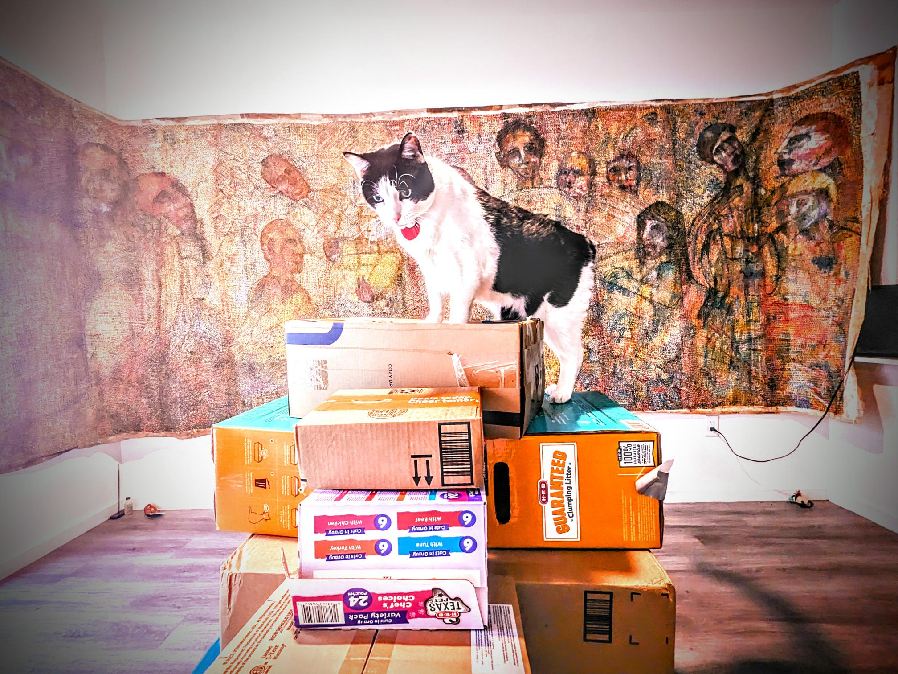

# **Jungle's Breath: Into the Unknown**

In the heart of the dense Amazonian jungle, Dr. Elena Hart led her team through the thick undergrowth, their breaths coming in ragged gasps mixed with anticipation. The air was heavy with humidity and the scent of ancient decay, while the symphony of unseen creatures echoed around them.

"Keep moving," Elena whispered urgently, her eyes scanning the dense foliage for any signs of danger or the elusive temple they sought. "We're close to Zora."

Behind her, Marco, their knowledgeable guide, nodded grimly, his fingers tracing an ancient map etched on a worn parchment. "Just received a new message from our contact in Brazil. They've detected some unusual activity nearby."

Elena's grip tightened on her machete as she paused to listen. A faint rumble of distant drums drifted through the trees, resonating with the legends of Zora.

"We’re not alone," she murmured, switching off her flashlight and motioning for everyone to halt.

The team froze, their senses heightened. The sounds of the jungle seemed louder in the sudden silence—the screech of macaws overhead, the rustling of unseen animals, and the steady drip of water from leaves above.

"Could be rival explorers or ancient guardians," Marco whispered, his voice barely audible.

"We need to keep moving," Elena decided, her resolve unshaken. "The temple is close, and we can't afford any delays."

They pushed forward, their steps quicker but more cautious. The canopy above filtered the sunlight, casting dappled shadows that danced menacingly around them. A sudden crack of a branch echoed behind them, sending a jolt of fear through Elena's veins.

"Stay alert," she hissed, her eyes darting back and forth.

A faint glimmer caught her eye—a hint of ancient stone peeking through the undergrowth. They had found it—the lost Temple of Zora. But as they stepped into the clearing, the air seemed to thicken with an ominous presence.

"Elena," Marco whispered urgently, pointing towards a hidden path leading deeper into the jungle. "There’s someone else here."

Before Elena could respond, shadowy figures emerged from the trees, blocking their way. The figures were cloaked and masked, holding ancient weapons, their eyes cold and calculating.

"We've been expecting you," one of them said, his voice echoing through the clearing. "And we can't let you interfere with our plans."

Elena's heart raced as she realized this was just the beginning of a much larger battle. She took a deep breath, her grip on the machete firm. Whatever lay ahead, they were ready to face it.

As the tension mounted and the jungle seemed to hold its breath, Elena knew that their adventure had only just begun—a thrilling dance with danger in the heart of the Amazon. The path before them branched into multiple directions, each promising a new challenge and a step closer to uncovering the secrets of Zora.

## Choices

* [Continue the adventure](./476902298_2026199734459132_8101314172205332991_n.md)
* [Continue the adventure](./20221013_140920.md)
* [Continue the adventure](./20221012_145451.md)

---
*Generated with AI assistance*
