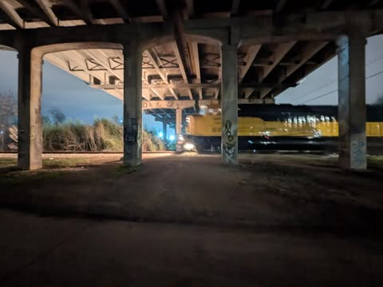

# Shadows of the Amazon Night

In the heart of the Amazonian jungle, the air thick with humidity and the scent of ancient earth, Dr. Elena Hart moved silently through the dense undergrowth. The moonlight filtered through the canopy, casting dappled shadows that hinted at both guidance and hidden perils. She had been tracking a legendary path to Zora for weeks, an ancient city shrouded in myth and danger.

"Elena, are you certain about this?" Marco whispered beside her, his voice barely audible over the rustling leaves and distant calls of nocturnal creatures. "This place... it feels ominous."

Elena nodded, her eyes fixed on the faint glow ahead—a beacon she had followed for miles. "We're close. I can feel it." Her heart pounded with a mix of excitement and trepidation as they approached an ancient stone temple, its walls concealed by moss and vines.

The entrance loomed before them, dark and forbidding. Elena's breath hitched as she stepped inside, the cold air sending shivers down her spine. Marco stayed close, his flashlight illuminating intricate carvings that seemed to tell a story of forgotten times.

At the center stood a pedestal, and atop it lay an ancient artifact—a crystal orb pulsating with raw energy. Elena reached out tentatively, her fingers inches from the orb.

Suddenly, a low rumble echoed through the chamber. The ground trembled beneath them, and the walls shook violently. "Elena, we need to go!" Marco shouted, his voice tinged with urgency.

She hesitated, torn between seizing the artifact and escaping the crumbling temple. With a final glance at the orb, she turned and ran, Marco close behind. As they fled, the chamber collapsed in on itself, swallowing the ancient secrets forever.

Outside, they didn't stop running until they were far from the ruined temple. Elena's breath came in ragged gasps, her mind racing with questions. Why had the artifact been so well-guarded? What power did it truly hold?

Marco looked at her, his eyes reflecting the moonlight. "We found something, Elena. Something dangerous."

Elena nodded, her resolve unshaken. "And we need to find out what it is." The adventure was far from over; in fact, it felt like they had only just begun to unravel a mystery that could change everything.

As they disappeared into the night, the jungle seemed to watch them go, its ancient secrets whispering in the wind. The path ahead was unclear, but Elena knew one thing for sure—their journey would lead them deeper into the heart of danger and discovery.

## Choices

* [Continue the adventure](./B0BHLH14NQ.01._SCLZZZZZZZ_SX500_.md)
* [Continue the adventure](./144327630_3930950650332675_7163600755928566265_n.md)

---
*Generated with AI assistance*
